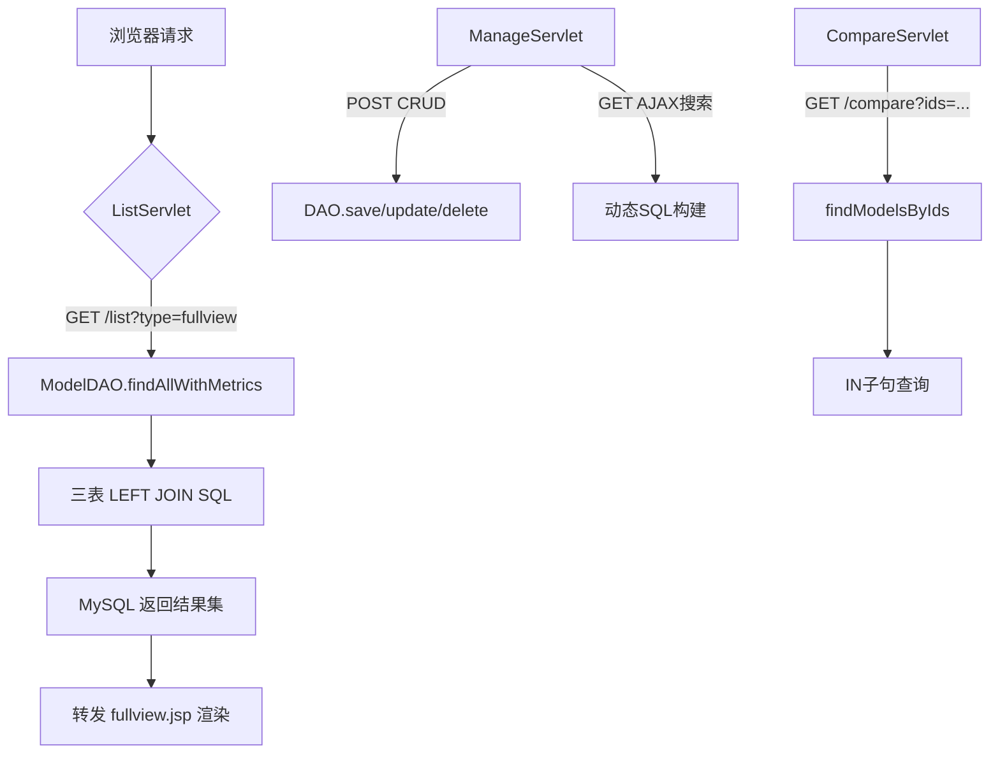

# 大模型性能对比评测系统 - 技术答辩 PPT 大纲

> **项目名称**：LLM Benchmark System  
> **技术栈**：Jakarta EE 5.0 (Servlet + JSP) + MySQL 8.0 + JDBC  
> **适用场景**：课程答辩 / 技术评审 / 项目演示

---

## 📑 目录

1. **项目概述与架构设计**
2. **模块一：JavaEE 前后端实现**（6页）
3. **模块二：MySQL 数据库实现**（6页）
4. **核心功能深度解析**（8页）
5. **总结与展望**

---

## 【第1页】封面

### 【页面标题】
大模型性能对比评测系统 —— 技术实现详解

### 【核心要点】
- 项目名称：LLM Benchmark System
- 技术选型：Jakarta EE 5.0 + MySQL 8.0 + Maven
- 开发周期：2026年春季
- 汇报人：XXX

### 【建议配图/截图描述】
- 首页导航卡片截图（四张卡片：厂商管理、模型管理、指标管理、综合表）
- 项目 Logo 或图标（可选）

---

## 【第2页】项目背景与目标

### 【页面标题】
为什么需要大模型评测平台？

### 【核心要点】
- **行业痛点**：AI 厂商激增（19家）、模型版本繁多（64个）、指标复杂（8维度）
- **用户需求**：快速筛选、横向对比、数据可视化
- **系统定位**：一站式 LLM 多维性能评估与管理平台

### 【建议配图/截图描述】
- 市场现状数据图（可简化为文字列表）
- 系统功能架构图（三层：展示层/业务层/数据层）

### 【关键代码/SQL 片段】
无（纯业务背景介绍）

---

## 【第3页】技术栈与整体架构

### 【页面标题】
技术选型与请求处理流程

### 【核心要点】
- **后端框架**：Jakarta Servlet 5.0 + JSP 3.0 + JSTL 3.0
- **服务器**：Apache Tomcat 10.1+
- **数据库**：MySQL 8.0 + Connector/J 8.0.33
- **构建工具**：Maven 3.x
- **前端**：HTML + CSS + JavaScript（AJAX，无第三方 JSON 库）

### 【建议配图/截图描述】
- 技术栈层级图（浏览器 → Servlet → DAO → MySQL）
- 请求流程图（见下文 Mermaid 图）

### 【关键代码/SQL 片段】



---

# ==================== 模块一：JavaEE 前后端实现 ====================

## 【第4页】模块一概述 - MVC 分层架构

### 【页面标题】
JavaEE 三层架构设计与职责划分

### 【核心要点】
- **控制层（Servlet）**：`ListServlet`（页面分发）、`ManageServlet`（CRUD + AJAX API）、`CompareServlet`（对比逻辑）
- **数据访问层（DAO）**：`BaseDAO`（模板方法）、`CreatorDAO`、`ModelDAO`、`ModelMetricDAO`
- **实体层（Entity）**：`Creator`、`Model`、`ModelMetric`、`ModelCompareVO`（三表 JOIN 视图对象）
- **工具层**：`DBUtil`（连接工厂，静态加载 `db.properties`）

### 【建议配图/截图描述】
- 项目目录结构树状图（标注各包职责）
- 类图：DAO 继承关系（`BaseDAO<T>` → 三个子类）

### 【关键代码/SQL 片段】

```java
// DBUtil.java - 静态代码块加载配置
static {
    Properties props = new Properties();
    props.load(DBUtil.class.getClassLoader()
        .getResourceAsStream("db.properties"));
    Class.forName(props.getProperty("db.driver"));
}

public static Connection getConnection() throws SQLException {
    return DriverManager.getConnection(url, username, password);
}
```

---

## 【第5页】Servlet 控制器设计

### 【页面标题】
三大 Servlet 的职责与交互逻辑

### 【核心要点】
1. **ListServlet（`/list`）**
   - 仅处理 GET 请求，根据 `type` 参数分发到不同 DAO
   - 调用 `findAll()` 加载初始数据，转发至对应 JSP
   - 无副作用，纯查询操作

2. **ManageServlet（`/manage`）**
   - GET：返回 JSON（厂商列表、无指标模型、AJAX 搜索）
   - POST：12 个 CRUD 操作（增删改查），含 SQL 回显
   - 手动拼接 JSON，无 Jackson/Gson 依赖

3. **CompareServlet（`/compare`）**
   - 接收逗号分隔的模型 ID（2~5 个）
   - 调用 `findModelsByIds()` 执行 IN 查询
   - Java Stream 计算 7 个最优值（maxCtx、minPrice 等）

### 【建议配图/截图描述】
- Servlet 映射表（URL → 方法 → DAO 调用）
- ManageServlet 的 action 分支流程图

### 【关键代码/SQL 片段】

```java
// ListServlet.doGet() - 页面分发
String type = req.getParameter("type");
if ("fullview".equals(type)) {
    List<ModelCompareVO> list = modelDAO.findAllWithMetrics();
    req.setAttribute("dataList", list);
    req.getRequestDispatcher("WEB-INF/views/fullview.jsp")
        .forward(req, resp);
}

// CompareServlet - 最优值计算
BigDecimal maxIntel = models.stream()
    .map(ModelCompareVO::getArtifIntelIdx)
    .filter(Objects::nonNull)
    .max(BigDecimal::compareTo)
    .orElse(null);
req.setAttribute("maxIntel", maxIntel);
```

---

## 【第6页】DAO 模式与模板方法

### 【页面标题】
BaseDAO 抽象基类与代码复用

### 【核心要点】
- **模板方法模式**：`BaseDAO<T>` 定义 `findAll()` 骨架（连接→执行→遍历→关闭）
- 子类只需实现两个抽象方法：
  - `getTableName()`：返回表名（硬编码，无用户输入）
  - `mapRow(ResultSet)`：将一行结果映射为实体对象
- **Statement vs PreparedStatement 选择**：
  - `SELECT * FROM table` 使用 `Statement`（无参数、零注入风险、少一次预编译）
  - 所有带 `?` 占位符的 SQL 统一使用 `PreparedStatement`

### 【建议配图/截图描述】
- BaseDAO 类图（泛型 `<T>`、抽象方法声明）
- 三个子类重写 `mapRow()` 的代码对比

### 【关键代码/SQL 片段】

```java
// BaseDAO.java - 模板方法
public abstract class BaseDAO<T> {
    public List<T> findAll() {
        List<T> list = new ArrayList<>();
        String sql = "SELECT * FROM " + getTableName(); // 静态拼接
        try (Connection conn = DBUtil.getConnection();
             Statement stmt = conn.createStatement();
             ResultSet rs = stmt.executeQuery(sql)) {
            while (rs.next()) {
                list.add(mapRow(rs)); // 多态调用子类实现
            }
        }
        return list;
    }
    
    protected abstract String getTableName();
    protected abstract T mapRow(ResultSet rs) throws SQLException;
}

// CreatorDAO 实现
@Override
protected String getTableName() { return "creators"; }

@Override
protected Creator mapRow(ResultSet rs) throws SQLException {
    Creator c = new Creator();
    c.setCreatorId(rs.getString("creator_id"));
    c.setCreatorName(rs.getString("creator_name"));
    c.setDescription(rs.getString("description"));
    return c;
}
```

---

## 【第7页】JSP 视图层与 AJAX 交互

### 【页面标题】
服务端渲染与异步数据更新

### 【核心要点】
1. **服务端渲染（SSR）**
   - `ListServlet` 转发时携带 `dataList` 属性
   - JSP 使用 JSTL `<c:forEach>` 迭代渲染表格
   - 首次加载速度快，SEO 友好

2. **AJAX 异步交互（综合表筛选）**
   - 用户调整筛选条件 → 点击"搜索"
   - `fetch('/manage?action=searchFullview&...')` 发起 GET 请求
   - 收到 JSON 后动态生成 `<tr>`，替换表格内容
   - **已选状态持久化**：JavaScript `Set` 不因搜索清空

3. **手动 JSON 构建策略**
   - 为何不用 Jackson/Gson？保持轻量，无第三方依赖
   - `escapeJson()` 转义五个特殊字符（`\`、`"`、`\n`、`\r`、`\t`）

### 【建议配图/截图描述】
- fullview.jsp 筛选面板截图（可折叠、多条件输入框）
- AJAX 请求时序图（前端 → ManageServlet → DAO → MySQL → JSON 响应）

### 【关键代码/SQL 片段】

```jsp
<!-- fullview.jsp - JSTL 渲染 -->
<c:forEach items="${dataList}" var="m">
    <tr>
        <td>${m.modelName}</td>
        <td>${m.creatorName}</td>
        <td><fmt:formatNumber value="${m.artifIntelIdx}" 
                              pattern="#.00"/></td>
    </tr>
</c:forEach>
```

```javascript
// fullview.jsp - AJAX 搜索
async function searchFullview() {
    const params = new URLSearchParams();
    document.querySelectorAll('input[name="creatorIds"]:checked')
        .forEach(cb => params.append('creatorIds', cb.value));
    params.append('artifIntelIdxMin', 
        document.getElementById('intelMin').value);
    
    const resp = await fetch('/manage?action=searchFullview&' + params);
    const data = await resp.json();
    renderFullview(data); // 动态更新表格
}
```

---

## 【第8页】实体类设计与可空字段处理

### 【页面标题】
包装类型与 NULL 值安全映射

### 【核心要点】
- **为何用包装类型？**
  - `Integer contextWindow` vs `int`：数据库列允许 NULL，`rs.getInt()` 返回 0 会与真实值混淆
  - `Boolean isOpenSource` vs `boolean`：NULL 表示"开源状态未知"
  - `BigDecimal` 用于 8 个指标字段：精确匹配 MySQL `DECIMAL(p,s)`，避免浮点精度丢失

- **可空字段的参数设置策略**
  ```java
  if (val != null) ps.setInt(idx, val);
  else ps.setNull(idx, java.sql.Types.INTEGER);
  ```
  - 显式传递 `java.sql.Types.XXX`，确保驱动生成正确的 `NULL` 字面量

### 【建议配图/截图描述】
- Model 实体类字段列表（标注哪些是包装类型）
- 数据库中 NULL 值在前端显示为 "—" 的截图

### 【关键代码/SQL 片段】

```java
// Model.java - 包装类型字段
private Integer contextWindow;      // INT NULL
private Boolean isOpenSource;       // TINYINT(1) NULL
private java.sql.Date releaseDate;  // DATE NULL

// ModelDAO.mapToCompareVO() - 空值安全处理
vo.setContextWindow(rs.getObject("context_window") != null
    ? rs.getInt("context_window") : null);
vo.setArtifIntelIdx(rs.getBigDecimal("artif_intel_idx")); 
// BigDecimal 可直接为 null

// 辅助方法 - setInt/setBoolean/setBigDecimal
private void setInt(PreparedStatement ps, int idx, Integer val) 
        throws SQLException {
    if (val != null) ps.setInt(idx, val);
    else ps.setNull(idx, java.sql.Types.INTEGER);
}
```

---

## 【第9页】JSON 手动构建与防注入

### 【页面标题】
无第三方库的轻量 JSON 方案

### 【核心要点】
- **手动拼接 JSON 的原因**
  - 结构简单（对象 + 基本类型数组），无需引入 Jackson/Gson
  - 减少依赖，降低 WAR 包体积
  - `escapeJson()` 覆盖所有转义需求

- **防注入措施**
  - 所有用户输入通过 `PreparedStatement` 的 `?` 占位符传递
  - `LIKE` 查询的通配符 `%` 在 Java 端拼接后存入参数列表
  - `ORDER BY` 的值来自前端固定下拉选项，非自由输入

### 【建议配图/截图描述】
- ManageServlet 返回的 JSON 示例（新增模型成功响应）
- escapeJson() 转义前后对比

### 【关键代码/SQL 片段】

```java
// ManageServlet - 手动构建 JSON
private void writeJson(HttpServletResponse resp, boolean success, 
                       String message, String sql) {
    StringBuilder json = new StringBuilder();
    json.append("{\"success\":").append(success)
        .append(",\"message\":\"").append(escapeJson(message))
        .append("\"");
    if (sql != null) {
        json.append(",\"sql\":\"").append(escapeJson(sql)).append("\"");
    }
    json.append("}");
    resp.setContentType("application/json;charset=UTF-8");
    resp.getWriter().write(json.toString());
}

private String escapeJson(String s) {
    if (s == null) return "";
    return s.replace("\\", "\\\\")      // 反斜杠
            .replace("\"", "\\\"")      // 双引号
            .replace("\n", "\\n")
            .replace("\r", "\\r")
            .replace("\t", "\\t");
}
```

---

# ==================== 模块二：MySQL 数据库实现 ====================

## 【第10页】模块二概述 - 数据库设计

### 【页面标题】
三张核心表的设计与关联关系

### 【核心要点】
- **creators（厂商表）**：19 条记录，主键 `creator_id`（可读短 ID，如 `oai`、`ant`）
- **models（模型表）**：64 条记录，外键 `creator_id` 关联 creators，`ON DELETE RESTRICT`
- **model_metrics（指标表）**：62 条记录，外键 `model_id` 关联 models，`ON DELETE CASCADE`
- **为何指标表独立？**
  - 职责分离：基础信息 vs 性能数据
  - 可空字段隔离：2 个模型缺少指标数据
  - 独立索引：`artif_intel_idx`、`blended_price` 上的索引优化排序查询

### 【建议配图/截图描述】
- ER 图（三张表的关联关系，标注外键约束）
- 表结构概览（字段名、类型、注释）

### 【关键代码/SQL 片段】

```sql
-- creators 表
CREATE TABLE creators (
    creator_id VARCHAR(10) PRIMARY KEY,
    creator_name VARCHAR(50) NOT NULL,
    description TEXT
) ENGINE=InnoDB DEFAULT CHARSET=utf8mb4 COLLATE=utf8mb4_unicode_ci;

-- models 表
CREATE TABLE models (
    model_id VARCHAR(10) PRIMARY KEY,
    model_name VARCHAR(100) NOT NULL,
    creator_id VARCHAR(10) NOT NULL,
    context_window INT NULL,
    is_open_source TINYINT(1) NULL DEFAULT 0,
    release_date DATE NULL,
    field_expertise VARCHAR(200),
    version_upgrade_note TEXT,
    FOREIGN KEY (creator_id) REFERENCES creators(creator_id)
        ON DELETE RESTRICT ON UPDATE CASCADE,
    INDEX idx_models_creator(creator_id),
    INDEX idx_models_release_date(release_date),
    INDEX idx_models_open_source(is_open_source)
);

-- model_metrics 表
CREATE TABLE model_metrics (
    model_id VARCHAR(10) PRIMARY KEY,
    artif_intel_idx DECIMAL(5,2),
    artif_omni_idx DECIMAL(5,2),
    terminal_bench_hard DECIMAL(5,2),
    aa_omni_accuracy DECIMAL(5,2),
    blended_price DECIMAL(8,4),
    median_tokens_s DECIMAL(8,2),
    latency_first_chunk DECIMAL(8,2),
    total_response_time DECIMAL(8,2),
    FOREIGN KEY (model_id) REFERENCES models(model_id)
        ON DELETE CASCADE ON UPDATE CASCADE,
    INDEX idx_metrics_intel(artif_intel_idx),
    INDEX idx_metrics_price(blended_price)
);
```

---

## 【第11页】三表 LEFT JOIN 查询策略

### 【页面标题】
综合表的核心 SQL：LEFT JOIN 而非 INNER JOIN

### 【核心要点】
- **为何用 LEFT JOIN？**
  - `models` 表 64 条记录，`model_metrics` 仅 62 条
  - 2 个模型无指标数据（`glm5t`、`glm5vt`），若用 `INNER JOIN` 会被静默排除
  - `LEFT JOIN` 保留所有模型，指标为 NULL 的行前端显示 "—"

- **两次 LEFT JOIN 的作用**
  1. `LEFT JOIN creators`：获取厂商名称（虽外键约束下不会缺失，但保证语义清晰）
  2. `LEFT JOIN model_metrics`：关键——允许指标数据缺失

- **排序策略**：`ORDER BY c.creator_name, m.model_name` 确保同一厂商的模型排列在一起

### 【建议配图/截图描述】
- 综合表截图（高亮显示两条无指标数据的模型行，指标列显示 "—"）
- JOIN 类型对比图（LEFT JOIN vs INNER JOIN 的结果集差异）

### 【关键代码/SQL 片段】

```sql
-- 无条件全量查询（ListServlet 初始加载）
SELECT m.*, c.creator_name,
       mt.artif_intel_idx, mt.artif_omni_idx,
       mt.terminal_bench_hard, mt.aa_omni_accuracy,
       mt.blended_price, mt.median_tokens_s,
       mt.latency_first_chunk, mt.total_response_time
FROM models m
LEFT JOIN creators c ON m.creator_id = c.creator_id
LEFT JOIN model_metrics mt ON m.model_id = mt.model_id
ORDER BY c.creator_name, m.model_name;

-- 执行结果：64 行（含 2 条指标全为 NULL 的记录）
```

---

## 【第12页】动态 SQL 构建技巧

### 【页面标题】
WHERE 1=1 与动态条件拼接

### 【核心要点】
- **"WHERE 1=1" 技巧**
  - 恒真条件，使后续所有条件统一用 `AND ...` 拼接
  - 无需判断"当前条件是否是第一个"来决定使用 `WHERE` 还是 `AND`
  - 数据库优化器自动忽略 `1=1`，无性能开销

- **四类动态条件的处理方式**
  1. **厂商多选**：动态 `IN (?, ?, ?)` 子句，占位符数量与传入 ID 数量一致
  2. **开源状态**：直接拼接常量 `= 1` 或 `= 0`（枚举值映射，非用户自由输入）
  3. **范围条件**：通用 `addRangeCondition()` 方法，支持 Min/Max
  4. **模糊查询**：`LIKE ?`，通配符 `%` 在 Java 端拼接后存入参数列表

- **排序拼接**：`ORDER BY` 直接拼接字符串（值来自前端固定下拉选项）

### 【建议配图/截图描述】
- 综合表筛选面板截图（勾选多个厂商、输入智力指数范围、选择排序方式）
- 动态 SQL 构建流程图（StringBuilder 逐步追加条件）

### 【关键代码/SQL 片段】

```java
// ModelDAO.findAllWithMetricsByConditions() - 动态 SQL 骨架
StringBuilder sql = new StringBuilder(
    "SELECT m.*, c.creator_name, mt.* FROM models m " +
    "LEFT JOIN creators c ON ... " +
    "LEFT JOIN model_metrics mt ON ... " +
    "WHERE 1=1"
);
List<Object> paramValues = new ArrayList<>();

// （A）厂商多选
if (creatorIds != null && !creatorIds.isEmpty()) {
    sql.append(" AND m.creator_id IN (");
    for (int i = 0; i < creatorIds.size(); i++) {
        sql.append(i > 0 ? ",?" : "?");
        paramValues.add(creatorIds.get(i));
    }
    sql.append(")");
}

// （B）开源状态
if ("open".equals(isOpenSource)) {
    sql.append(" AND m.is_open_source = 1");
} else if ("closed".equals(isOpenSource)) {
    sql.append(" AND m.is_open_source = 0");
}

// （C）范围条件（通用方法）
addRangeCondition(sql, paramValues, "mt.artif_intel_idx", intelMin, intelMax);

// （D）模糊查询
if (fieldExpertise != null && !fieldExpertise.trim().isEmpty()) {
    sql.append(" AND m.field_expertise LIKE ?");
    paramValues.add("%" + fieldExpertise.trim() + "%");
}

// （E）排序
if (orderBy != null) {
    sql.append(" ORDER BY ").append(orderBy);
}

// 参数绑定
try (PreparedStatement ps = conn.prepareStatement(sql.toString())) {
    for (int i = 0; i < paramValues.size(); i++) {
        ps.setObject(i + 1, paramValues.get(i));
    }
}
```

---

## 【第13页】范围条件与类型自适应

### 【页面标题】
addRangeCondition 方法与 parseNumber 类型识别

### 【核心要点】
- **通用范围条件方法**
  ```java
  addRangeCondition(sql, params, column, min, max)
  ```
  - 覆盖 6 组范围字段：上下文窗口、智力指数、价格、吞吐量、发布日期等
  - Min 和 Max 可单独存在（只填下限或上限）

- **parseNumber() 类型自适应**
  - 整数 → `Integer.parseInt()`
  - 小数 → `Double.parseDouble()`
  - 日期字符串 → 原样返回，由 JDBC 驱动自行处理
  - 避免将金额 `"2.46"` 误解析为整数导致精度丢失

### 【建议配图/截图描述】
- 筛选面板的范围输入框截图（智力指数 Min=40, Max=60）
- parseNumber() 方法的决策树流程图

### 【关键代码/SQL 片段】

```java
// 通用范围条件方法
private void addRangeCondition(StringBuilder sql, List<Object> params,
                               String column, Object min, Object max) {
    if (min != null && !min.toString().trim().isEmpty()) {
        sql.append(" AND ").append(column).append(" >= ?");
        params.add(parseNumber(min));
    }
    if (max != null && !max.toString().trim().isEmpty()) {
        sql.append(" AND ").append(column).append(" <= ?");
        params.add(parseNumber(max));
    }
}

// 类型自适应解析
private Object parseNumber(Object val) {
    if (val instanceof Number) return val;
    String s = val.toString().trim();
    try {
        if (s.contains(".")) return Double.parseDouble(s);   // 小数
        return Integer.parseInt(s);                           // 整数
    } catch (NumberFormatException e) {
        return s;   // 日期字符串等
    }
}

// 生成的 SQL 示例
-- AND mt.artif_intel_idx >= ?    -- 参数：40 (Integer)
-- AND mt.artif_intel_idx <= ?    -- 参数：60 (Integer)
-- AND mt.blended_price <= ?      -- 参数：2.0 (Double)
```

---

## 【第14页】CRUD 操作与级联删除

### 【页面标题】
单表写入操作与外键协同

### 【核心要点】
1. **INSERT 操作**
   - 所有字段通过 `?` 占位符传递，杜绝 SQL 注入
   - 可空字段显式调用 `ps.setNull(idx, Types.XXX)`

2. **UPDATE 操作**
   - 主键不参与 UPDATE，仅作 WHERE 条件（遵循"主键不可变"原则）
   - 外键定义了 `ON UPDATE CASCADE`，但 Java 层不修改主键

3. **DELETE 操作与级联**
   - **厂商删除**：前置检查 `hasRelatedModels()`，若有关联模型则阻止删除
   - **模型删除**：外键 `ON DELETE CASCADE` 自动删除 `model_metrics` 对应行
   - 数据库层有 `ON DELETE RESTRICT` 兜底，防止绕过 Java 代码的直接 SQL 操作

### 【建议配图/截图描述】
- 模态框 CRUD 操作截图（新增厂商、编辑模型、删除指标）
- 外键约束示意图（RESTRICT vs CASCADE）

### 【关键代码/SQL 片段】

```sql
-- 厂商 INSERT
INSERT INTO creators (creator_id, creator_name, description) 
VALUES (?, ?, ?);

-- 模型 UPDATE（主键不参与）
UPDATE models SET model_name = ?, creator_id = ?, context_window = ?,
                  is_open_source = ?, release_date = ?, 
                  field_expertise = ?, version_upgrade_note = ?
WHERE model_id = ?;

-- 模型 DELETE（级联删除指标）
DELETE FROM models WHERE model_id = ?;
-- 数据库自动执行：DELETE FROM model_metrics WHERE model_id = ?

-- 厂商删除前置检查
SELECT COUNT(*) FROM models WHERE creator_id = ?;
-- 若 count > 0，Java 层返回错误提示："该厂商下仍有模型，无法删除"
```

```java
// ModelDAO - 可空参数设置
if (m.getReleaseDate() != null) {
    ps.setDate(6, m.getReleaseDate());
} else {
    ps.setNull(6, java.sql.Types.DATE);
}

// ManageServlet - 业务校验
if (m.getAaOmniAccuracy() != null &&
    (m.getAaOmniAccuracy().compareTo(BigDecimal.ZERO) < 0 ||
     m.getAaOmniAccuracy().compareTo(new BigDecimal("100")) > 0)) {
    writeJson(resp, false, "AA-Omni准确率必须在0~100之间");
    return;
}
```

---

## 【第15页】索引优化与查询性能

### 【页面标题】
数据库索引设计与性能考量

### 【核心要点】
- **主键索引**
  - `creators.creator_id`、`models.model_id`、`model_metrics.model_id` 均为 `VARCHAR(10)`
  - 使用可读短 ID（如 `gpt55xh`）而非自增整数，便于调试和 URL 传参

- **外键索引**
  - `models.creator_id`：加速 JOIN 查询和前置检查
  - `model_metrics.model_id`：加速级联删除

- **业务索引**
  - `idx_models_release_date(release_date)`：支持按发布日期范围筛选
  - `idx_models_open_source(is_open_source)`：支持开源状态筛选
  - `idx_metrics_intel(artif_intel_idx)`：支持智力指数排序和范围查询
  - `idx_metrics_price(blended_price)`：支持价格排序和范围查询

- **索引选择原则**
  - 高频查询字段（排序、范围、JOIN）建立索引
  - 低基数字段（`is_open_source` 仅 0/1）是否建索引需权衡（本项目建立了）

### 【建议配图/截图描述】
- EXPLAIN 分析截图（展示索引使用情况）
- 索引列表截图（Navicat 或 MySQL Workbench）

### 【关键代码/SQL 片段】

```sql
-- 查看索引使用情况
EXPLAIN SELECT m.*, c.creator_name, mt.artif_intel_idx
FROM models m
LEFT JOIN creators c ON m.creator_id = c.creator_id
LEFT JOIN model_metrics mt ON m.model_id = mt.model_id
WHERE mt.artif_intel_idx >= 50
ORDER BY mt.blended_price ASC;

-- 预期结果：
-- models 表：使用 idx_models_creator（JOIN）
-- model_metrics 表：使用 idx_metrics_intel（WHERE 范围）
-- 排序：可能使用 filesort（若数据量大，可考虑复合索引）
```

---

# ==================== 核心功能深度解析 ====================

## 【第16页】功能一：综合表展示

### 【页面标题】
综合表（Full View）- 三表 JOIN 一体化视图

### 【功能效果】
- 展示 64 个模型的完整信息：模型名称、厂商、上下文窗口、开源状态、发布日期、8 个性能指标
- 无指标数据的模型显示 "—"（2 条记录）
- 按厂商名升序、同名厂商内按模型名升序排列

### 【JavaEE 实现原理】
- **Servlet**：`ListServlet.doGet()` 接收 `type=fullview` 参数
- **DAO**：`ModelDAO.findAllWithMetrics()` 执行静态三表 LEFT JOIN
- **实体**：`ModelCompareVO` 聚合三表字段（models.* + creator_name + metrics.*）
- **JSP**：`fullview.jsp` 使用 JSTL `<c:forEach>` 迭代渲染表格

### 【MySQL 完整 SQL 代码】

```sql
-- 综合表初始加载 SQL（无条件全量查询）
SELECT m.*, c.creator_name,
       mt.artif_intel_idx, mt.artif_omni_idx,
       mt.terminal_bench_hard, mt.aa_omni_accuracy,
       mt.blended_price, mt.median_tokens_s,
       mt.latency_first_chunk, mt.total_response_time
FROM models m
LEFT JOIN creators c ON m.creator_id = c.creator_id
LEFT JOIN model_metrics mt ON m.model_id = mt.model_id
ORDER BY c.creator_name, m.model_name;

-- 作用：一次性获取所有模型及其关联的厂商名和性能指标
-- 返回行数：64（含 2 条指标全为 NULL 的记录）
```

### 【建议配图/截图描述】
- 综合表完整截图（64 行数据，高亮显示两条无指标数据的模型）
- ModelCompareVO 类结构图（字段列表）

---

## 【第17页】功能二：多条件筛选与排序

### 【页面标题】
综合表筛选面板 - 动态 SQL 构建

### 【功能效果】
- **筛选条件**：
  - 厂商多选（复选框，支持全选/取消全选）
  - 开源状态下拉框（全部/开源/闭源）
  - 上下文窗口、智力指数、价格、吞吐量的 Min/Max 输入框
  - 擅长领域模糊搜索
  - 发布日期范围选择器
- **排序方式**：智力指数、价格、吞吐量、发布日期（升序/降序）
- **交互体验**：点击"搜索"后 AJAX 异步更新表格，已选模型状态保持不变

### 【JavaEE 实现原理】
- **前端**：`searchFullview()` 函数读取表单值，构建 `URLSearchParams`，发起 `fetch` 请求
- **Servlet**：`ManageServlet.doGet()?action=searchFullview` 解析参数到 `Map<String, Object>`
- **DAO**：`ModelDAO.findAllWithMetricsByConditions(params, orderBy)` 动态拼接 SQL
  - `WHERE 1=1` 作为恒真条件
  - 厂商多选 → `IN (?, ?, ?)`
  - 范围条件 → `addRangeCondition()` 通用方法
  - 模糊查询 → `LIKE ?`（通配符 `%` 在 Java 端拼接）
- **JSON 响应**：手动拼接 JSON 字符串，返回给前端

### 【MySQL 完整 SQL 代码】

```sql
-- 示例：筛选 OpenAI + DeepSeek 的开源模型，智力指数 ≥ 50，按价格升序
SELECT m.*, c.creator_name,
       mt.artif_intel_idx, mt.artif_omni_idx,
       mt.terminal_bench_hard, mt.aa_omni_accuracy,
       mt.blended_price, mt.median_tokens_s,
       mt.latency_first_chunk, mt.total_response_time
FROM models m
LEFT JOIN creators c ON m.creator_id = c.creator_id
LEFT JOIN model_metrics mt ON m.model_id = mt.model_id
WHERE 1=1
  AND m.creator_id IN ('oai', 'deep')          -- 厂商多选
  AND m.is_open_source = 1                      -- 开源状态
  AND mt.artif_intel_idx >= 50                  -- 智力指数下限
ORDER BY mt.blended_price ASC;                  -- 价格升序

-- 参数绑定方式：所有用户输入通过 PreparedStatement 的 ? 占位符传递
-- 防注入机制：杜绝 SQL 注入风险
```

### 【建议配图/截图描述】
- 筛选面板展开截图（勾选 OpenAI + DeepSeek，输入智力 50~60，选择价格升序）
- AJAX 请求的网络面板截图（Request URL、Response JSON）
- 筛选后的表格结果截图

---

## 【第18页】功能三：模型横向对比

### 【页面标题】
对比页（Compare）- 多模型并排分析

### 【功能效果】
- 用户勾选 2~5 个模型 → 点击"开始对比" → 跳转至对比页
- 横向并列表格：每个模型一列，展示所有字段（模型信息 + 8 个指标）
- **最优值高亮**：绿色背景标记每行的最优值（智力最高、价格最低、速度最快等）
- **差异总结面板**：
  - 智力最高模型
  - 性价比最高模型（智力/价格比）
  - 速度最快模型（吞吐量最高）
  - 综合推荐（加权评分）

### 【JavaEE 实现原理】
- **前端**：`startCompare()` 函数收集已选模型 ID，拼接 URL `/compare?ids=gpt55xh,cl47mx,dsv4pm`
- **Servlet**：`CompareServlet.doGet()` 解析逗号分隔的 ID，校验数量（2~5 个）
- **DAO**：`ModelDAO.findModelsByIds(ids)` 执行 IN 子句查询
  - SELECT 部分和 JOIN 结构与 `findAllWithMetrics()` 完全相同（SQL 复用）
  - WHERE 条件：`m.model_id IN (?, ?, ?)`
- **最优值计算**：Java Stream API 计算 7 个最优值，存入 request attribute
- **JSP**：`compare.jsp` 渲染横向表格，使用 EL 表达式比对最优值并添加 CSS 类

### 【MySQL 完整 SQL 代码】

```sql
-- 对比查询 SQL（按 ID 批量查询）
SELECT m.*, c.creator_name,
       mt.artif_intel_idx, mt.artif_omni_idx,
       mt.terminal_bench_hard, mt.aa_omni_accuracy,
       mt.blended_price, mt.median_tokens_s,
       mt.latency_first_chunk, mt.total_response_time
FROM models m
LEFT JOIN creators c ON m.creator_id = c.creator_id
LEFT JOIN model_metrics mt ON m.model_id = mt.model_id
WHERE m.model_id IN ('gpt55xh', 'cl47mx', 'dsv4pm');

-- 作用：获取指定 3 个模型的完整信息（与综合表口径一致）
-- 参数绑定：ps.setString(1, "gpt55xh"); ps.setString(2, "cl47mx"); ...
-- 返回行数：3
```

### 【建议配图/截图描述】
- 对比页完整截图（3 个模型并排，最优值绿底高亮）
- 差异总结面板截图（智力最高：GPT-5.5 xhigh，性价比最高：DeepSeek V4 Pro Max）

---

## 【第19页】功能四：CRUD 管理（厂商/模型/指标）

### 【页面标题】
三表 CRUD 管理 - 模态框弹窗与 SQL 回显

### 【功能效果】
- **厂商管理**：新增/编辑/删除厂商，删除前检查是否有关联模型
- **模型管理**：新增/编辑/删除模型，可空字段（上下文窗口、开源状态、发布日期）支持留空
- **指标管理**：新增/编辑/删除性能指标，数值范围校验（如 AA-Omni 准确率 0~100）
- **交互方式**：点击"新增"或"编辑"按钮弹出模态框，填写后提交
- **SQL 回显**：操作成功后返回实际执行的 SQL 语句，帮助用户理解后台逻辑

### 【JavaEE 实现原理】
- **前端**：Bootstrap 模态框（或自定义 CSS 模态框），表单验证（必填项、正则校验）
- **Servlet**：`ManageServlet.doPost()` 根据 `action` 参数分发到 12 个 CRUD 方法
  - 参数校验（正则、非空、范围）
  - 调用对应 DAO 的 `save()`/`update()`/`deleteById()`
  - 捕获异常（如主键重复、外键约束冲突），返回友好提示
- **DAO**：`PreparedStatement` 执行参数化查询，可空字段显式调用 `setNull()`
- **SQL 回显**：`ManageServlet` 中的 `sqlStr()`、`sqlNum()`、`sqlBool()`、`sqlDate()` 辅助方法生成可读 SQL 字符串

### 【MySQL 完整 SQL 代码】

```sql
-- 新增厂商
INSERT INTO creators (creator_id, creator_name, description) 
VALUES ('anth', 'Anthropic', '专注于AI安全与可控性');

-- 编辑模型（主键不参与 UPDATE）
UPDATE models SET model_name = 'GPT-5.5 (xhigh)', 
                  creator_id = 'oai', 
                  context_window = 922000,
                  is_open_source = 0, 
                  release_date = '2026-04-23',
                  field_expertise = '通用推理、代码生成、长文本分析',
                  version_upgrade_note = 'xhigh配置：最高推理深度'
WHERE model_id = 'gpt55xh';

-- 删除模型（级联删除指标）
DELETE FROM models WHERE model_id = 'gpt55xh';
-- 数据库自动执行：DELETE FROM model_metrics WHERE model_id = 'gpt55xh';

-- 删除厂商前置检查
SELECT COUNT(*) FROM models WHERE creator_id = 'oai';
-- 若 count > 0，阻止删除并返回提示

-- 新增指标（可空字段）
INSERT INTO model_metrics (model_id, artif_intel_idx, artif_omni_idx,
       terminal_bench_hard, aa_omni_accuracy, blended_price,
       median_tokens_s, latency_first_chunk, total_response_time)
VALUES ('gpt55xh', 60.00, 20.00, 61.00, 57.00, 4.3500, 71.00, 32.54, 39.60);
```

### 【建议配图/截图描述】
- 模态框新增厂商截图（填写 ID、名称、描述）
- 删除厂商时的错误提示截图（"该厂商下仍有模型，无法删除"）
- SQL 回显的 JSON 响应截图

---

## 【第20页】功能五：已选状态持久化

### 【页面标题】
边选边搜 - JavaScript Set 的状态管理

### 【功能效果】
- 用户在综合表勾选模型 → 调整筛选条件 → 点击"搜索"
- 表格内容更新，但**已选模型的勾选状态保持不变**
- 支持"边选边搜"的流畅体验，无需重新勾选

### 【JavaEE 实现原理】
- **前端状态管理**：
  - `selectedModelIds` 是一个 JavaScript `Set`，存储已选模型的 ID
  - 搜索/排序/重置操作**永不**修改此 Set
  - 仅在用户勾选/取消勾选时同步更新
  - AJAX 回调 `renderFullview(data)` 中，根据 `selectedModelIds` 恢复复选框状态
- **后端无状态**：Servlet 和 DAO 不维护会话状态，每次请求独立处理

### 【建议配图/截图描述】
- 用户操作流程截图：
  1. 勾选 3 个模型
  2. 调整筛选条件（如智力指数 ≥ 50）
  3. 点击"搜索"，表格更新，但 3 个模型的勾选状态仍保留

### 【关键代码/SQL 片段】

```javascript
// fullview.jsp - 全局状态变量
let selectedModelIds = new Set(); // 永不因搜索清空

// 勾选/取消勾选时同步
function toggleModelSelection(modelId, isChecked) {
    if (isChecked) {
        selectedModelIds.add(modelId);
    } else {
        selectedModelIds.delete(modelId);
    }
}

// AJAX 回调中恢复勾选状态
function renderFullview(data) {
    let html = '';
    data.forEach(m => {
        const isChecked = selectedModelIds.has(m.modelId) ? 'checked' : '';
        html += `<tr>
            <td><input type="checkbox" value="${m.modelId}" ${isChecked} 
                       onchange="toggleModelSelection('${m.modelId}', this.checked)"></td>
            <td>${m.modelName}</td>
            ...
        </tr>`;
    });
    document.getElementById('fullviewTableBody').innerHTML = html;
}
```

---

## 【第21页】设计决策答辩要点

### 【页面标题】
关键技术决策与理由

### 【核心要点】
1. **指标表与模型表分离（1:1 而非合并）**
   - 职责分离：基础信息 vs 性能数据
   - 可空字段隔离：2 个模型缺少指标数据
   - 独立索引优化排序查询

2. **包装类型处理可空字段**
   - `Integer` vs `int`：区分"值为 0"与"值不存在"
   - `Boolean` vs `boolean`：NULL 表示"开源状态未知"
   - `BigDecimal` 精确匹配 `DECIMAL(p,s)`

3. **Statement vs PreparedStatement 的选择**
   - `SELECT * FROM table` 使用 `Statement`（无参数、零注入风险、少一次预编译）
   - 所有带 `?` 的 SQL 统一使用 `PreparedStatement`

4. **LEFT JOIN 而非 INNER JOIN**
   - 保留无指标数据的模型，前端显示 "—"，用户可明确感知数据缺失

5. **WHERE 1=1 的动态 SQL 策略**
   - 简化条件拼接逻辑，数据库优化器消除恒真条件

6. **手动 JSON 拼接而非引入库**
   - 结构简单，保持轻量，`escapeJson()` 覆盖所有转义需求

### 【建议配图/截图描述】
- 决策对比表（方案 A vs 方案 B，优缺点对比）

### 【关键代码/SQL 片段】
无（纯理论阐述）

---

## 【第22页】部署与运行环境

### 【页面标题】
环境要求与关键避坑指南

### 【核心要点】
- **环境要求**
  - JDK 21+
  - Apache Tomcat 10.1+（必须支持 Jakarta EE 5.0）
  - MySQL 8.0+（先执行 `llm_benchmark.sql` 初始化）
  - Maven 3.x（使用 `.mvn/settings.xml` 阿里云镜像）
  - MySQL Connector/J 8.0.33（勿使用 9.x，API 不兼容）

- **关键避坑**
  1. JDBC URL 中 `characterEncoding=UTF-8`，不能写成 `utf8mb4`
     - `utf8mb4` 是 MySQL 内部的字符集名字，JDBC 不认识
     - 若错误使用会导致页面中文乱码
  2. 必须使用 `com.mysql.cj.jdbc.Driver`（8.x 驱动），而非旧版 `com.mysql.jdbc.Driver`
  3. Tomcat 必须是 10.1+（`jakarta.servlet.*` 而非 `javax.servlet.*`）

### 【建议配图/截图描述】
- db.properties 配置文件截图
- Tomcat 启动日志截图（无报错）

### 【关键代码/SQL 片段】

```properties
# db.properties
db.driver=com.mysql.cj.jdbc.Driver
db.url=jdbc:mysql://localhost:3306/llm_benchmark?useSSL=false&serverTimezone=UTC&characterEncoding=UTF-8&allowPublicKeyRetrieval=true
db.username=root
db.password=********
```

---

## 【第23页】总结与展望

### 【页面标题】
项目总结与未来优化方向

### 【核心要点】
- **已完成功能**
  - 三张核心表的 CRUD 管理（模态框弹窗）
  - 综合表展示（三表 LEFT JOIN，64 条记录）
  - 多条件筛选与排序（动态 SQL 构建）
  - 模型横向对比（2~5 个模型，最优值高亮）
  - 已选状态持久化（边选边搜）

- **技术亮点**
  - Jakarta EE 5.0 原生 Servlet + JSP，无 Spring 框架依赖
  - DAO 模板方法模式，代码复用率高
  - 动态 SQL 构建技巧（WHERE 1=1、IN 子句、范围条件）
  - 手动 JSON 拼接，轻量无依赖

- **未来优化方向**
  - 引入连接池（HikariCP）提升并发性能
  - 分页查询（综合表数据量增大时）
  - 引入 Jackson/Gson 简化 JSON 处理
  - 前端框架升级（Vue.js / React）
  - 单元测试（JUnit 5 + Mockito）

### 【建议配图/截图描述】
- 项目功能清单打勾图
- 技术栈演进路线图

### 【关键代码/SQL 片段】
无（纯总结）

---

## 【第24页】Q&A

### 【页面标题】
感谢聆听 · 欢迎提问

### 【核心要点】
- 联系方式：XXX
- 项目仓库：GitHub / GitLab 链接（如有）
- 文档参考：《项目技术实现与SQL详解文档.md》、《项目说明文档.md》

### 【建议配图/截图描述】
- 致谢页面（简洁大方）
- 二维码（可选，指向项目仓库或演示视频）

---

# 📌 附录：答辩准备清单

## 可演示 SQL 实例列表

| 编号 | SQL 类型 | 用途 | 演示方式 |
|------|---------|------|---------|
| 1 | `SELECT * FROM creators` | 全表查询（厂商 19 条） | 访问 `/list?type=creators` |
| 2 | `SELECT * FROM models` | 全表查询（模型 64 条） | 访问 `/list?type=models` |
| 3 | `SELECT * FROM model_metrics` | 全表查询（指标 62 条） | 访问 `/list?type=metrics` |
| 4 | 三表 LEFT JOIN + ORDER BY | 综合表初始加载（64 行，含 2 条无指标） | 访问 `/list?type=fullview` |
| 5 | 三表 JOIN + `WHERE creator_id IN` + 范围条件 + `ORDER BY` | 条件筛选（如 OpenAI+DeepSeek，智力≥50，按价格升序） | 综合表筛选面板操作 |
| 6 | 三表 JOIN + `WHERE model_id IN (?,?,?)` | 对比查询（2~5 个模型） | 勾选后点击"开始对比" |
| 7 | `INSERT INTO creators VALUES (?,?,?)` | 新增厂商（含回显） | 厂商管理页新增操作 |
| 8 | `DELETE FROM models WHERE model_id=?`（级联删指标） | 删除模型 | 模型管理页删除操作 |
| 9 | `SELECT COUNT(*) FROM models WHERE creator_id=?` | 删除前置检查 | 删除有模型的厂商触发提示 |
| 10 | `UPDATE model_metrics SET ... WHERE model_id=?` | 更新指标 | 指标管理页编辑操作 |

## 常见答辩问题预判

1. **为何不使用 Spring Framework？**
   - 答：课程要求掌握原生 Servlet + JSP，理解底层原理；Spring 是上层封装，学习曲线陡峭

2. **为何指标表独立而不合并到 models 表？**
   - 答：职责分离、可空字段隔离、独立索引优化（详见【第21页】设计决策 1）

3. **动态 SQL 如何防止注入？**
   - 答：所有用户输入通过 `PreparedStatement` 的 `?` 占位符传递，数据库驱动自动转义（详见【第12页】）

4. **LEFT JOIN 与 INNER JOIN 的性能差异？**
   - 答：在小数据量（64 行）下无明显差异；LEFT JOIN 保留无指标数据的模型，业务语义更清晰

5. **为何手动拼接 JSON 而不引入 Jackson？**
   - 答：保持项目轻量，无第三方依赖；JSON 结构简单，`escapeJson()` 覆盖所有转义需求

6. **如何处理并发请求？**
   - 答：每次 `getConnection()` 返回全新连接，配合 try-with-resources 确保使用后立刻关闭；未来可引入连接池（HikariCP）提升性能

---

**文档结束**

*本 PPT 大纲基于项目 v1.0 源代码编写，所有 SQL 语句、Java 代码片段均来自实际文件，可直接用于代码审查与技术答辩。*
